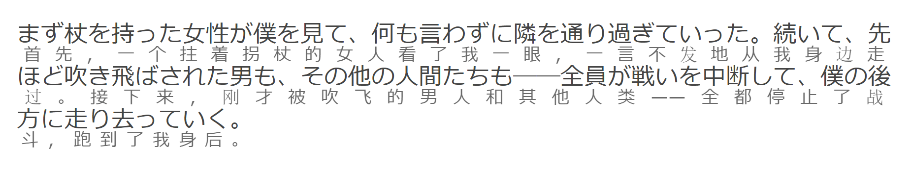
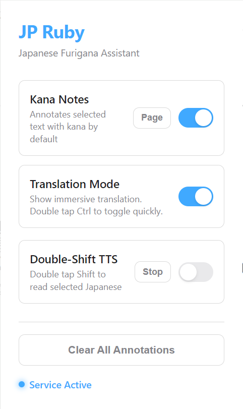

# KanjiRuby - 日语汉字注音助手

[日本語](docs/README.ja.md) | 简体中文

KanjiRuby 是一个面向日语阅读学习的 Chrome 扩展。它可以为网页中的日语汉字添加假名注音，并在需要时把选中的日文内容沉浸式翻译成中文，让阅读小说、新闻、博客或学习材料时更顺畅。

> 当前版本依赖本地 Python 后端服务。使用前需要先启动后端，再加载 Chrome 扩展。

## 效果展示

### 汉字注音

选中网页中的日语文本后，KanjiRuby 会将文本发送到本地后端分析。后端使用 `fugashi + unidic-lite` 进行分词和读音解析，再由扩展在网页中渲染 Ruby 注音。

注音前：

<p align="center">
  
</p>

注音后：

<p align="center">
  
</p>


### 沉浸式翻译

开启翻译模式后，选中网页中的日文文本，扩展会请求后端进行翻译，并把中文结果显示在原文下方。

<p align="center">
  
</p>

### 扩展面板

扩展面板提供注音、翻译、TTS、快捷键和清除等常用控制项。

<p align="center">
  
</p>

## 功能概览

- **汉字自动注音**：识别网页中的日语汉字，并用 Ruby 形式显示平假名读音。
- **选中文本翻译**：选中日文文本后，在原文下方显示中文翻译。
- **全网页一键注音**：通过扩展面板扫描当前页面文本，并批量添加假名标注。
- **双击 Ctrl 切换**：支持双击 `Ctrl` 快速开启或关闭翻译模式。
- **TTS 朗读**：支持对日文内容进行语音朗读，辅助听读练习。
- **一键清除**：移除页面中的全部注音和翻译，恢复原始网页内容。
- **排版保护**：尽量保留原网页的段落、换行和文本结构，避免注音后破坏阅读体验。

## 项目组成

KanjiRuby 由两部分组成：

- **Chrome 扩展**：负责页面交互、文本选择、注音展示、翻译展示和控制面板。
- **Python 后端**：负责日语分词、读音解析和翻译请求。

当前版本依赖本地后端服务。Chrome 扩展会把用户选中的日语文本发送到 `http://127.0.0.1:18000/analyze`，由 FastAPI 后端返回分词结果、假名读音和可选的中文翻译。

只安装扩展但不启动后端时，注音和翻译请求无法完成。

## 安装与运行

本项目包含后端服务和浏览器扩展，两部分都需要准备完成后才能正常使用。

### 1. 启动后端服务

确保本机已安装 Python 3.8 或更高版本。

安装依赖：

```bash
pip install -r requirements.txt
```

也可以手动安装：

```bash
pip install fastapi uvicorn fugashi unidic-lite pydantic httpx deep-translator
```

启动服务：

```text
run_backend.bat
```

在 Windows 中，也可以直接双击项目根目录下的 `run_backend.bat`。服务默认运行在：

```text
http://127.0.0.1:18000
```

### 2. 加载 Chrome 扩展

1. 打开 Chrome 浏览器，在地址栏输入 `chrome://extensions/`。
2. 开启右上角的「开发者模式」。
3. 点击「加载已解压的扩展程序」。
4. 选择本项目中的 `extension` 目录。

加载完成后，浏览器工具栏中会出现 KanjiRuby 扩展入口。

## 使用方法

### 注音

选中网页中的日语文本后，使用扩展面板触发注音。KanjiRuby 会识别文本中的汉字，并在页面中添加平假名读音。

### 翻译

开启翻译模式后，选中日文文本即可查看中文翻译。翻译功能目前使用 `deep-translator` 调用 Google Translate。

### 快捷切换

在扩展设置中开启 Double-Tap Shortcut 后，连续按两次 `Ctrl` 可以快速切换翻译模式。切换时页面会显示提示弹窗。

## 开发计划

- [x] 基础汉字注音
- [x] 选中文本翻译
- [x] 全网页一键注音
- [x] HTTPS 页面兼容
- [x] 双击 Ctrl 快捷切换
- [x] TTS 功能
- [ ] 支持更多翻译引擎，如 DeepL 或 OpenAI
- [ ] 探索后端云端化或扩展内置化方案

## 许可证

本项目使用 MIT License。
